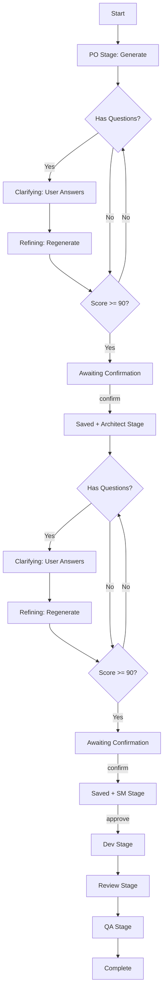

# BMAD-MCP

**Business-Minded Agile Development** workflow orchestrator as an MCP (Model Context Protocol) server.

Complete agile development workflow: **PO → Architect → SM → Dev → Review → QA**

**Interactive Requirements Gathering** - Asks clarifying questions to ensure complete requirements
**Dynamic Engine Selection** - Uses Claude by default, dual-engine when needed
**Content Reference System** - Efficient token usage via file references
**Human-Readable Task Names** - Organizes by task name, not UUID

---

## 🎯 What is BMAD-MCP?

BMAD-MCP is a lightweight workflow orchestrator that manages the complete agile development process. It:

- **Manages workflow state** (which stage you're in, what's needed next)
- **Dispatches role prompts** (provides detailed prompts for each role)
- **Saves artifacts** (PRD, architecture, code, reports)
- **Does NOT call LLMs** (that's Claude Code's job)

## 🏗️ Architecture

```
User → Claude Code → bmad-mcp tool
                       ↓
            Returns: {
              stage: "po",
              role_prompt: "<complete PO prompt>",
              engines: ["claude", "codex"],
              context: {...}
            }
                       ↓
Claude Code executes:
  - Calls Claude (with role_prompt)
  - Calls Codex MCP (with role_prompt)
                       ↓
Claude Code submits results → bmad-mcp
                       ↓
bmad-mcp: merges, scores, saves, advances to next stage
```

## 📋 Workflow Stages

| Stage | Role | Engines | Description |
|-------|------|---------|-------------|
| **PO** | Product Owner | Claude + Codex | Requirements analysis (merge both) |
| **Architect** | System Architect | Claude + Codex | Technical design (merge both) |
| **SM** | Scrum Master | Claude | Sprint planning |
| **Dev** | Developer | Codex | Code implementation |
| **Review** | Code Reviewer | Codex | Code review |
| **QA** | QA Engineer | Codex | Testing and quality assurance |

## 🚀 Installation

### NPM Install (Recommended)

```bash
npm install -g bmad-mcp
```

### Build from Source

```bash
git clone https://github.com/cexll/bmad-mcp-server
cd bmad-mcp-server
npm install
npm run build
npm link  # or: npm install -g .
```

## 🔧 Setup

### Add to Claude Code

```bash
claude mcp add-json --scope user bmad-task '{"type":"stdio","command":"bmad-mcp"}'
```

### Verify Installation

```bash
# Test the server
bmad-mcp
# Should output: "BMAD MCP Server running on stdio"
```

## 📖 Usage

### Basic Workflow

```typescript
// 1. Start workflow
const startResult = await callTool("bmad-task", {
  action: "start",
  cwd: "/path/to/your/project",
  objective: "Implement user login system"
});

const { session_id, task_name, role_prompt, engines } = JSON.parse(startResult.content[0].text);

// 2. Execute with engines
if (engines.includes("claude")) {
  const claudeResult = await callClaude(role_prompt);
}
if (engines.includes("codex")) {
  const codexResult = await callCodexMCP(role_prompt);
}

// 3. Submit results
await callTool("bmad-task", {
  action: "submit",
  session_id: session_id,
  stage: "po",
  claude_result: claudeResult,
  codex_result: codexResult
});

// 4. Confirm and proceed (unified: saves + advances to next stage)
await callTool("bmad-task", {
  action: "confirm",
  session_id: session_id,
  confirmed: true
});
```

### Actions

#### `start` - Start a new workflow

```json
{
  "action": "start",
  "cwd": "/path/to/project",
  "objective": "Project description"
}
```

**Returns**:
```json
{
  "session_id": "uuid",
  "task_name": "project-description",
  "stage": "po",
  "state": "generating",
  "stage_description": "Product Owner - Requirements Analysis",
  "requires_user_confirmation": true,
  "interaction_type": "awaiting_generation",
  "user_message": "📋 **BMAD 工作流已启动**...",
  "role_prompt": "<complete prompt>",
  "engines": ["claude"],
  "context": {...},
  "pending_user_actions": ["review_and_confirm_generation"]
}
```

#### `submit` - Submit stage results

```json
{
  "action": "submit",
  "session_id": "uuid",
  "stage": "po",
  "claude_result": "...",
  "codex_result": "..."
}
```

**Returns** (if score >= 90):
```json
{
  "session_id": "uuid",
  "stage": "po",
  "state": "awaiting_confirmation",
  "score": 92,
  "requires_user_confirmation": true,
  "interaction_type": "user_decision",
  "user_message": "✅ **PRD生成完成**\n质量评分：92/100...",
  "final_draft_summary": "...",
  "final_draft_file": ".bmad-task/temp/uuid/po_final_result_xxx.md",
  "pending_user_actions": ["confirm", "reject_and_refine"]
}
```

**Returns** (if score < 90 with clarification questions):
```json
{
  "session_id": "uuid",
  "stage": "po",
  "state": "clarifying",
  "current_score": 75,
  "requires_user_confirmation": true,
  "interaction_type": "user_decision",
  "user_message": "⚠️ **需求澄清...**",
  "gaps": ["Target user group unclear", "..."],
  "questions": [{"id": "q1", "question": "...", "context": "..."}],
  "pending_user_actions": ["answer_questions"]
}
```

#### `confirm` - Confirm and save (unified action)

```json
{
  "action": "confirm",
  "session_id": "uuid",
  "confirmed": true
}
```

**Returns** (saves artifact + advances to next stage):
```json
{
  "session_id": "uuid",
  "stage": "architect",
  "state": "generating",
  "requires_user_confirmation": true,
  "interaction_type": "awaiting_generation",
  "user_message": "💾 **文档已保存，并已进入下一阶段**...",
  "role_prompt": "<architect prompt>",
  "engines": ["claude"],
  "previous_artifact": ".claude/specs/task-name/01-product-requirements.md",
  "pending_user_actions": ["review_and_confirm_generation"]
}
```

#### `answer` - Answer clarification questions

```json
{
  "action": "answer",
  "session_id": "uuid",
  "answers": {
    "q1": "Target users are enterprise B2B customers",
    "q2": "Expected 10k concurrent users with <200ms response time"
  }
}
```

**Returns**:
```json
{
  "session_id": "uuid",
  "stage": "po",
  "state": "refining",
  "requires_user_confirmation": true,
  "interaction_type": "awaiting_regeneration",
  "user_message": "📝 **已收到你的回答**...",
  "role_prompt": "<updated prompt with user answers>",
  "engines": ["claude"],
  "pending_user_actions": ["regenerate_with_answers"]
}
```

#### `approve` - Approve current stage (SM stage only)

```json
{
  "action": "approve",
  "session_id": "uuid",
  "approved": true
}
```

**Returns**:
```json
{
  "session_id": "uuid",
  "stage": "dev",
  "state": "generating",
  "role_prompt": "<dev prompt>",
  "engines": ["codex"],
  "pending_user_actions": ["review_and_confirm_generation"]
}
```

#### `status` - Query workflow status

```json
{
  "action": "status",
  "session_id": "uuid"
}
```

**Returns**:
```json
{
  "session_id": "uuid",
  "current_stage": "dev",
  "current_state": "generating",
  "stages": {...},
  "artifacts": [...]
}
```

## 📁 File Structure

### Your Project

```
your-project/
├── .bmad-task/
│   ├── session-abc-123.json          # Workflow state (with content references)
│   ├── task-mapping.json             # Maps session_id → task_name
│   └── temp/
│       └── abc-123/                  # Temporary content files
│           ├── po_claude_result_xxx.md
│           ├── po_codex_result_xxx.md
│           └── po_final_result_xxx.md
├── .claude/
│   └── specs/
│       └── implement-user-login/     # Task name (human-readable slug)
│           ├── 01-product-requirements.md
│           ├── 02-system-architecture.md
│           ├── 03-sprint-plan.md
│           ├── 04-dev-reviewed.md
│           └── 05-qa-report.md
└── src/
```

### Session State File

```json
{
  "session_id": "abc-123",
  "task_name": "implement-user-login",
  "cwd": "/path/to/project",
  "objective": "Implement user login",
  "current_stage": "dev",
  "current_state": "generating",
  "stages": {
    "po": {
      "status": "completed",
      "claude_result_ref": {
        "summary": "First 300 chars...",
        "file_path": ".bmad-task/temp/abc-123/po_claude_result_xxx.md",
        "size": 12450,
        "last_updated": "2025-01-15T10:30:00Z"
      },
      "final_result_ref": {...},
      "score": 92,
      "approved": true
    },
    ...
  },
  "artifacts": [".claude/specs/implement-user-login/01-product-requirements.md", ...]
}
```

## 🎨 Engine Configuration

### PO & Architect Stages (Dynamic Engine Selection)

- **Default**: Only Claude (single engine)
- **Dual Engine**: Enabled when objective contains "codex" or "使用 codex"
- If dual engine enabled:
  - Calls both Claude and Codex
  - Each generates independent solution
  - BMAD-MCP merges results:
    - If both ≥ 90: choose higher score
    - If one ≥ 90: choose that one
    - If both < 90: choose higher score, refine
- **Interactive Clarification**:
  - First iteration: Identify gaps, generate 3-5 clarification questions
  - User answers questions
  - Regenerate based on answers
  - Iterate until score ≥ 90

### SM Stage (Claude Only)

- Only calls Claude
- Scrum planning doesn't need Codex

### Dev/Review/QA Stages (Codex Only)

- Only calls Codex MCP
- Uses GPT-5 for code tasks
- **Important**: Use `model: "gpt-5"` (NOT "gpt-5-codex")
- Parameters:
  - `model: "gpt-5"`
  - `sandbox: "danger-full-access"`
  - `approval-policy: "on-failure"`

## 🔄 Workflow Flow



## 🛠️ Development

### Project Structure

```
bmad-mcp/
├── src/
│   ├── index.ts              # Main MCP server
│   └── master-prompt.ts      # All role prompts
├── dist/                     # Compiled output
├── package.json
├── tsconfig.json
└── README.md
```

### Build

```bash
npm run build
```

### Development Mode

```bash
npm run dev  # Watch mode
```

### Test Locally

```bash
npm run build
node dist/index.js
```

## 📚 Master Orchestrator Design

All role prompts are embedded in a single `master-prompt.ts` file:

- **Centralized management**: All roles in one place
- **Workflow definition**: Clear stage sequence
- **Engine configuration**: Which engines for each stage
- **Quality gates**: Score thresholds and approval points

## 🤝 Integration with Codex MCP

When calling Codex for Dev/Review/QA stages:

```typescript
// Claude Code calls Codex MCP
await callTool("codex", {
  prompt: role_prompt,  // From bmad-task
  model: "gpt-5",  // IMPORTANT: Use "gpt-5", NOT "gpt-5-codex"
  sandbox: "danger-full-access",
  "approval-policy": "on-failure"
});
```

## ⚙️ Configuration

### Quality Thresholds

Defined in `master-prompt.ts`:

```typescript
quality_gates: {
  po: { min_score: 90, approval_required: true },
  architect: { min_score: 90, approval_required: true },
  sm: { approval_required: true },
  dev: {},
  review: {},
  qa: {}
}
```

### Artifact Filenames

```typescript
artifacts: {
  po: "01-product-requirements.md",
  architect: "02-system-architecture.md",
  sm: "03-sprint-plan.md",
  dev: "code-implementation",
  review: "04-dev-reviewed.md",
  qa: "05-qa-report.md"
}
```

## 🔍 Troubleshooting

### Server not starting

```bash
# Check installation
which bmad-mcp

# Test directly
bmad-mcp
```

### Tool name error

- **Important**: The tool name is `bmad-task`, not `bmad`
- Use `callTool("bmad-task", {...})` in your code
- Claude Code configuration should use `bmad-task` as the tool name

### Session not found

- Ensure `.bmad-task/` directory has write permissions
- Check `session_id` is correct
- Verify `cwd` path is absolute

### Scores not detected

- Ensure generated content includes: `Quality Score: X/100` or `"quality_score": 92` in JSON
- Check score format matches pattern (0-100)
- Score ≥ 90 required for PO/Architect stages to advance

### Clarification workflow issues

- If you see `state: "clarifying"`, user must answer questions via `answer` action
- Do NOT auto-generate answers - wait for real user input
- Check `requires_user_confirmation: true` before proceeding

## 📝 License

MIT

## 🙋 Support

- **Documentation**: This README
- **Issues**: GitHub issues
- **Reference**: https://github.com/cexll/myclaude

---

**Transform your development with BMAD** - One workflow, complete agile process, quality assured.
