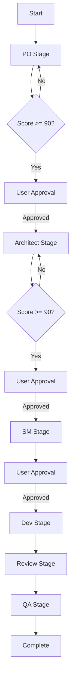

# BMAD-MCP

**Business-Minded Agile Development** workflow orchestrator as an MCP (Model Context Protocol) server.

Complete agile development workflow: **PO → Architect → SM → Dev → Review → QA**

---

## 🎯 What is BMAD-MCP?

BMAD-MCP is a lightweight workflow orchestrator that manages the complete agile development process. It:

- **Manages workflow state** (which stage you're in, what's needed next)
- **Dispatches role prompts** (provides detailed prompts for each role)
- **Saves artifacts** (PRD, architecture, code, reports)
- **Does NOT call LLMs** (that's Claude Code's job)

## 🏗️ Architecture

```
User → Claude Code → bmad-mcp tool
                       ↓
            Returns: {
              stage: "po",
              role_prompt: "<complete PO prompt>",
              engines: ["claude", "codex"],
              context: {...}
            }
                       ↓
Claude Code executes:
  - Calls Claude (with role_prompt)
  - Calls Codex MCP (with role_prompt)
                       ↓
Claude Code submits results → bmad-mcp
                       ↓
bmad-mcp: merges, scores, saves, advances to next stage
```

## 📋 Workflow Stages

| Stage | Role | Engines | Description |
|-------|------|---------|-------------|
| **PO** | Product Owner | Claude + Codex | Requirements analysis (merge both) |
| **Architect** | System Architect | Claude + Codex | Technical design (merge both) |
| **SM** | Scrum Master | Claude | Sprint planning |
| **Dev** | Developer | Codex | Code implementation |
| **Review** | Code Reviewer | Codex | Code review |
| **QA** | QA Engineer | Codex | Testing and quality assurance |

## 🚀 Installation

### NPM Install (Recommended)

```bash
npm install -g bmad-mcp
```

### Build from Source

```bash
git clone https://github.com/your-repo/bmad-mcp
cd bmad-mcp
npm install
npm run build
npm link  # or: npm install -g .
```

## 🔧 Setup

### Add to Claude Code

```bash
claude mcp add-json --scope user bmad '{"type":"stdio","command":"bmad-mcp"}'
```

### Verify Installation

```bash
# Test the server
bmad-mcp
# Should output: "BMAD MCP Server running on stdio"
```

## 📖 Usage

### Basic Workflow

```typescript
// 1. Start workflow
const startResult = await callTool("bmad", {
  action: "start",
  cwd: "/path/to/your/project",
  objective: "Implement user login system"
});

const { session_id, role_prompt, engines } = JSON.parse(startResult.content[0].text);

// 2. Execute with engines
if (engines.includes("claude")) {
  const claudeResult = await callClaude(role_prompt);
}
if (engines.includes("codex")) {
  const codexResult = await callCodexMCP(role_prompt);
}

// 3. Submit results
await callTool("bmad", {
  action: "submit",
  session_id: session_id,
  stage: "po",
  claude_result: claudeResult,
  codex_result: codexResult
});

// 4. Approve and continue
await callTool("bmad", {
  action: "approve",
  session_id: session_id,
  approved: true
});
```

### Actions

#### `start` - Start a new workflow

```json
{
  "action": "start",
  "cwd": "/path/to/project",
  "objective": "Project description"
}
```

**Returns**:
```json
{
  "session_id": "uuid",
  "stage": "po",
  "role_prompt": "<complete prompt>",
  "engines": ["claude", "codex"],
  "context": {...},
  "next_action": "generate_prd"
}
```

#### `submit` - Submit stage results

```json
{
  "action": "submit",
  "session_id": "uuid",
  "stage": "po",
  "claude_result": "...",
  "codex_result": "..."
}
```

**Returns** (if score >= 90):
```json
{
  "session_id": "uuid",
  "stage": "po",
  "state": "awaiting_approval",
  "score": 92,
  "artifact_path": ".claude/specs/uuid/01-product-requirements.md",
  "next_action": "user_approval"
}
```

**Returns** (if score < 90):
```json
{
  "session_id": "uuid",
  "stage": "po",
  "state": "refining",
  "current_score": 75,
  "iteration": 2,
  "next_action": "regenerate"
}
```

#### `approve` - Approve current stage

```json
{
  "action": "approve",
  "session_id": "uuid",
  "approved": true
}
```

**Returns**:
```json
{
  "session_id": "uuid",
  "stage": "architect",
  "role_prompt": "<architect prompt>",
  "engines": ["claude", "codex"],
  "next_action": "generate_architecture"
}
```

#### `status` - Query workflow status

```json
{
  "action": "status",
  "session_id": "uuid"
}
```

**Returns**:
```json
{
  "session_id": "uuid",
  "current_stage": "dev",
  "current_state": "generating",
  "stages": {...},
  "artifacts": [...]
}
```

## 📁 File Structure

### Your Project

```
your-project/
├── .bmad-task/
│   └── session-abc-123.json          # Workflow state
├── .claude/
│   └── specs/
│       └── abc-123/                  # Session artifacts
│           ├── 01-product-requirements.md
│           ├── 02-system-architecture.md
│           ├── 03-sprint-plan.md
│           ├── 04-dev-reviewed.md
│           └── 05-qa-report.md
└── src/
```

### Session State File

```json
{
  "session_id": "abc-123",
  "cwd": "/path/to/project",
  "objective": "Implement user login",
  "current_stage": "dev",
  "current_state": "generating",
  "stages": {
    "po": {
      "status": "completed",
      "claude_result": "...",
      "codex_result": "...",
      "final_result": "...",
      "score": 92,
      "approved": true
    },
    ...
  },
  "artifacts": [...]
}
```

## 🎨 Engine Configuration

### PO & Architect Stages (Dual Engine)

- Calls both Claude and Codex
- Each generates independent solution
- BMAD-MCP merges results:
  - If both ≥ 90: choose higher score
  - If one ≥ 90: choose that one
  - If both < 90: choose higher score, refine

### SM Stage (Claude Only)

- Only calls Claude
- Scrum planning doesn't need Codex

### Dev/Review/QA Stages (Codex Only)

- Only calls Codex MCP
- Uses GPT-5 for code tasks
- Parameters:
  - `model: "gpt-5-codex"`
  - `sandbox: "danger-full-access"`
  - `approval-policy: "on-failure"`

## 🔄 Workflow Flow



## 🛠️ Development

### Project Structure

```
bmad-mcp/
├── src/
│   ├── index.ts              # Main MCP server
│   └── master-prompt.ts      # All role prompts
├── dist/                     # Compiled output
├── package.json
├── tsconfig.json
└── README.md
```

### Build

```bash
npm run build
```

### Development Mode

```bash
npm run dev  # Watch mode
```

### Test Locally

```bash
npm run build
node dist/index.js
```

## 📚 Master Orchestrator Design

All role prompts are embedded in a single `master-prompt.ts` file:

- **Centralized management**: All roles in one place
- **Workflow definition**: Clear stage sequence
- **Engine configuration**: Which engines for each stage
- **Quality gates**: Score thresholds and approval points

## 🤝 Integration with Codex MCP

When calling Codex for Dev/Review/QA stages:

```typescript
// Claude Code calls Codex MCP
await callTool("codex", {
  prompt: role_prompt,  // From bmad-mcp
  model: "gpt-5-codex",
  sandbox: "danger-full-access",
  "approval-policy": "on-failure"
});
```

## ⚙️ Configuration

### Quality Thresholds

Defined in `master-prompt.ts`:

```typescript
quality_gates: {
  po: { min_score: 90, approval_required: true },
  architect: { min_score: 90, approval_required: true },
  sm: { approval_required: true },
  dev: {},
  review: {},
  qa: {}
}
```

### Artifact Filenames

```typescript
artifacts: {
  po: "01-product-requirements.md",
  architect: "02-system-architecture.md",
  sm: "03-sprint-plan.md",
  dev: "code-implementation",
  review: "04-dev-reviewed.md",
  qa: "05-qa-report.md"
}
```

## 🔍 Troubleshooting

### Server not starting

```bash
# Check installation
which bmad-mcp

# Test directly
bmad-mcp
```

### Session not found

- Ensure `.bmad-task/` directory has write permissions
- Check `session_id` is correct
- Verify `cwd` path is absolute

### Scores not detected

- Ensure generated content includes: `Quality Score: X/100`
- Check score format matches pattern

## 📝 License

MIT

## 🙋 Support

- **Documentation**: This README
- **Issues**: GitHub issues
- **Reference**: https://github.com/cexll/myclaude

---

**Transform your development with BMAD** - One workflow, complete agile process, quality assured.
